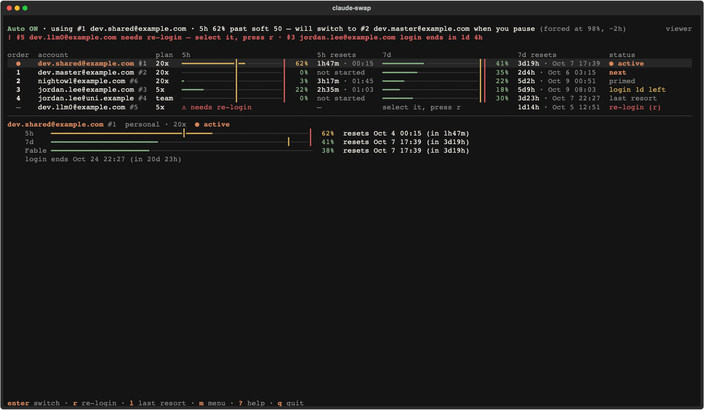
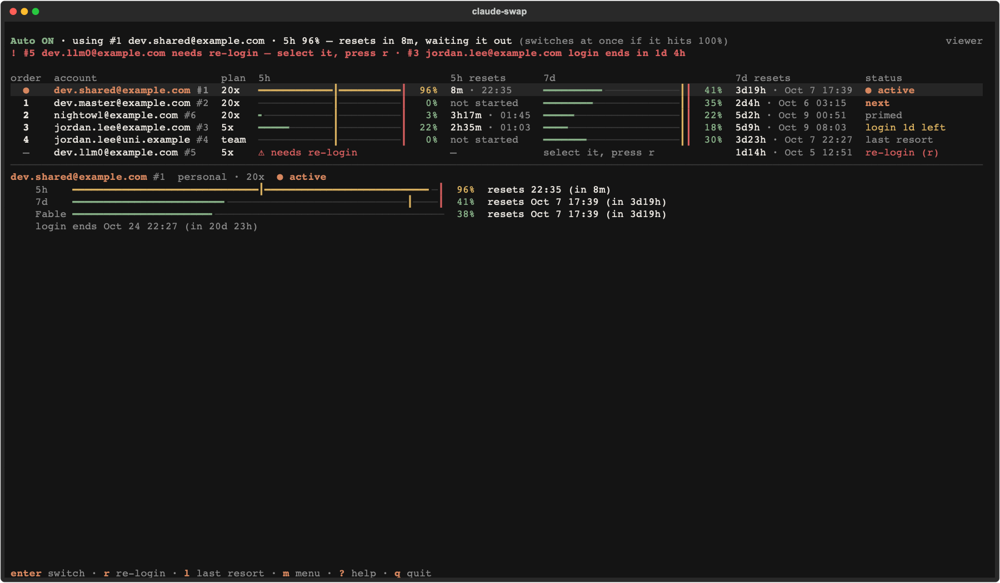
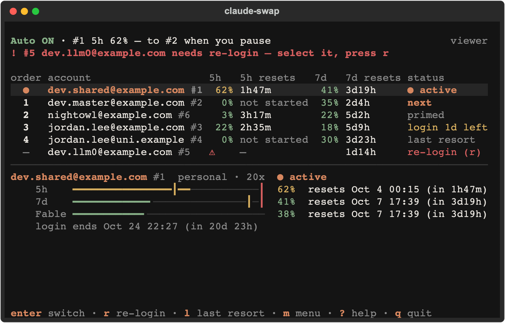

# cc-swap

**cc-swap** is a fork of [claude-swap](https://github.com/realiti4/claude-swap) (`cswap`) for running several Claude Code subscriptions at once. It keeps everything upstream does and adds an auto-switch strategy that tries to keep the most usable quota in hand at every moment:

- **`maximize` strategy**: separate soft and hard thresholds for the 5-hour and 7-day windows. It spends the accounts whose weekly quota would otherwise expire unused first, switches at an idle moment once a soft threshold is crossed, and switches immediately at a hard ceiling. It waits out a window that is about to reset instead of switching, and learns when you are usually quiet so a move it can see coming happens at an idle moment rather than in the middle of your work.
- **Last-resort and excluded accounts**: `cc-swap last-resort add <account>` keeps an account in reserve until nothing else can take you; `cc-swap disable` (upstream) keeps one out of rotation entirely.
- **5h window priming** (opt-in): starts an idle account's 5-hour window right after it resets, so the window is already counting down when you need the account.
- **Always-on service**: `cc-swap service install` runs the engine under launchd (macOS) or systemd (Linux). A lease guarantees one engine per machine.

The upstream documentation follows [below](#claude-swap), and everything in it applies to cc-swap. During the transition cc-swap installs both `cc-swap` and `cswap`, so commands written as `cswap …` keep working.

Where the upstream sections below install, upgrade or remove `claude-swap` from PyPI, use the fork instead — running the upstream commands would replace cc-swap with upstream:

| Upstream command | cc-swap equivalent |
|---|---|
| `uv tool install claude-swap` / `pipx install claude-swap` | `uv tool install git+https://github.com/wonjun-lab/cc-swap` |
| `uv tool install 'claude-swap[menubar]'` | `uv tool install 'cc-swap[menubar] @ git+https://github.com/wonjun-lab/cc-swap'` |
| `uv tool upgrade claude-swap` / `pipx upgrade claude-swap` | `cc-swap upgrade` (installs the latest fork release tag) |
| `uv tool uninstall claude-swap` | `uv tool uninstall cc-swap` |

## Install

```bash
uv tool install git+https://github.com/wonjun-lab/cc-swap
```

To upgrade, run `cc-swap upgrade`. If the service is installed, `cc-swap upgrade` re-runs `cc-swap service install` for you after a successful reinstall, so the service restarts on the new build. (Reinstalling by hand with `uv tool install --force git+https://github.com/wonjun-lab/cc-swap` leaves the service on the old build until you run `cc-swap service install`.)

`cc-swap upgrade --check` only reports: it prints the installed and the latest release, then the release notes and commit subjects in between. It exits `0` when you are up to date, `10` when an update is available, `2` when GitHub could not be asked and the cache cannot settle it (see below) and `1` when no release is published yet, so a timer can run it daily.

`upgrade` and `upgrade --check` look the latest release up on the GitHub API, which allows only 60 anonymous requests an hour per IP. They authenticate when they can: with `$GITHUB_TOKEN` or `$GH_TOKEN` if set, otherwise with the token from `gh auth token` when the GitHub CLI is on your `PATH` (given 3 seconds to answer). The token is sent only to `api.github.com`, as `Authorization: Bearer`, and is never printed or logged; with no token, or one GitHub rejects, the lookup goes out anonymously.

When the lookup fails (rate limited, offline, ...) they say so on stderr, for example `cc-swap: could not reach GitHub (rate limited until 05:12); using cached cc-v0.3.1 from 2h ago — it may be out of date`. A cached release never counts as proof that you are current: if it matches or trails what you run, `upgrade` prints `cannot confirm the latest release`, changes nothing and exits `2` (`upgrade --check` exits `2` too, without saying "up to date"; `upgrade --force` still reinstalls the cached release). A cached release newer than what you run is still installed (`upgrade`) or reported as an update (`upgrade --check`, exit `10`). With nothing cached, `upgrade` installs the default branch and says so. The passive update notice (checked at most once a day before other commands) stays fast: one request with a 2-second timeout, authenticated only by `$GITHUB_TOKEN` or `$GH_TOKEN` — it never runs `gh` and never retries without a refused token — and it stays silent when it cannot reach GitHub.

### Migrating from cswap

cc-swap reads and writes the same data as claude-swap: the backup directory (`~/.claude-swap-backup`, or `~/.local/share/claude-swap` on Linux) and the `claude-swap` Keychain items. Your accounts carry over without logging in again. The two tools must not run side by side, because two engines would fight over the active account.

1. Close every running `cswap`: TUI windows, `cswap auto` loops, cron jobs that run `cswap auto --once`, and the menu bar's *Auto-switch accounts* toggle.
2. `uv tool uninstall claude-swap`
3. `uv tool install git+https://github.com/wonjun-lab/cc-swap`
4. `cc-swap config set autoswitch.strategy maximize`. The service runs plain `cc-swap auto`, which reads its strategy from the settings.
5. `cc-swap service install`

`cc-swap init` checks these steps for you, and `cc-swap doctor` explains anything left (see [Diagnostics](#diagnostics-doctor-init-why)).

To go back, run `cc-swap service uninstall`, `uv tool uninstall cc-swap` and `uv tool install claude-swap`. Upstream warns about the unknown `maximize` strategy, falls back to `best`, and ignores the `maximize`/`prime` settings.

cc-swap does not manage extra usage (pay-as-you-go beyond the plan). If you never want it, turn it off in your claude.ai account settings.

## The `maximize` strategy

Turn it on with `cc-swap config set autoswitch.strategy maximize`, or use `cc-swap auto --strategy maximize` for one run.

**Tiers.** Accounts held out with `cc-swap disable` are *excluded*: they are never a target and never primed, although a manual `cc-swap switch` still works. Accounts listed in `maximize.lastResort` are *last resort*: they are used only when no normal account can take you. `cc-swap last-resort add|remove|list <account>` edits that list by email or alias, never by slot number, because slots move. Every other account is *normal*.

**Where it may land.** A target must sit below each soft threshold by `maximize.landingMargin`. It must not be quarantined or an API-key account, and its usage must be known. A target whose 5h window is off counts as 0%.

**Which account first.** `score = (100 − 7d used %) ÷ (days until the 7d reset × 100/7)`, with the days floored at one hour. A score above 1 means more weekly quota is left than an even pace would use before the reset; that quota would otherwise expire. Higher scores go first: an account with 30% left and a reset in 12 hours (score 4.2) beats one with 90% left and six days to go (score 1.05). Scores within `maximize.tieEpsilon` tie. Ties go to 20x plans first, then to the 5h window that resets soonest (a window that is off goes last), then to the lower slot.

**When it switches** (the first match wins):

| Trigger | When | Waits for idle |
|---|---|---|
| `at-limit` | the active 5h or 7d window is at 100% | no |
| `hard` | 5h ≥ `hard5h` or 7d ≥ `hard7d`, or the last 10 minutes' pace reaches a hard ceiling within `forceEtaMin` | no |
| `soft` | 5h ≥ `soft5h` or 7d ≥ `soft7d` | yes |
| `preempt` | the active 7d is on pace to pass `soft7d` before your next quiet time and another account's is not (`maximize.preempt`; see *Switching while you are idle* below; at most once per `rebalanceCooldownMin`) | yes |
| `rebalance` | a better-scored account exists, or the active one is excluded / last resort (at most once per `rebalanceCooldownMin`) | yes |
| `failover` | the active account's usage could not be read `autoswitch.unhealthyTicks` times in a row | no |

*Idle* means two usage readings at least `idleWindowMin` apart, with at most `idleMaxDeltaPct` growth in both windows. While it waits, the active account is polled every `pendingPollS` seconds. Usage from other machines on the same account counts too: there is no coordination between machines, and cc-swap trusts only what the server reports.

**Waiting out a reset.** A switch makes Claude Code re-read the whole context on the new account, and a window that is about to reset clears the reason to switch. So when the window behind a `hard` or `soft` switch resets within `maximize.resetWaitMin` minutes (default 15) and the recent pace will not reach 100% until at least 2 minutes after that, maximize holds (`reset-wait`), polling the active account every 60 s in the last 15 minutes before the reset. The pace is projected from the last reading and counted from now, so an older reading leaves less room. With no pace measured yet, it waits only while that window is under its hard ceiling, and a window past its hard ceiling is never waited out while the active account is backing off after a 429 (it could not be polled every 60 s). At 100% the `at-limit` switch still happens at once, a trigger on the other window still switches, and `rebalance` never waits. Fleet's top line reads `Auto ON · using #1 main · 5h 96% — resets in 8m, waiting it out (switches at once if it hits 100%)`, counting the minutes down.

**Switching while you are idle.** The engine keeps a small usage history (`usage_history.jsonl` in the backup root: each account's hourly 5h/7d percentages for 8 days, and for 14 days whether the active account's 5h rose in each 15-minute slot). It records only readings it already has, so the poll budget is unchanged. From that it learns when you are usually busy, weekdays and weekends apart, once it has 3 days of data; a *quiet window* is an hour or more of slots that were busy less than 20% of the time. With `maximize.preempt`, if the active 7d is on pace to pass `soft7d` before your next quiet window (at most `preemptHorizonMaxH` hours away, 4 hours while nothing is learned yet), and another account would not, it switches at an idle moment now (trigger `preempt`, after `rebalanceCooldownMin`) instead of being forced to later. In a usually-busy time, a rebalance gaining less than `busyRebalanceGap` waits for a quiet window that starts within 6 hours, and a rebalance never lands on an account whose own 7d would pass `soft7d` within that same horizon (preempt would only move you off it again). Neither ever overrides `at-limit`, `hard`, `soft` or `reset-wait`. `cc-swap why` and `cc-swap doctor` show what has been learned, and so do Fleet's help (`?`) and its Swap strategy screen: `idle pattern: 9 days learned · next quiet window 23:00–07:30`. Fleet's top line words both cases: `7d 84% would pass 90% in ~3h, before your usual quiet time (23:00) — will move to #2 side when you pause`, then `switching #1 main → #2 side now while you're idle`, or `rebalance deferred to your quiet time (23:00)`.

`cc-swap auto --once --dry-run` prints each account's tier, score, landing eligibility and idle state, plus the decision and its reason. It needs no engine lease, so it works while the service runs.

### Settings

| Key | Type | Default | Meaning |
|---|---|---|---|
| `autoswitch.strategy` | choice | best | Upstream key; cc-swap adds `maximize` |
| `maximize.soft5h` | float 1–99.9 | 50 | 5h soft threshold: at or above it, switch at the next idle moment |
| `maximize.hard5h` | float 1–99.9 | 95 | 5h hard ceiling: switch at once (must be ≥ soft5h) |
| `maximize.soft7d` | float 1–99.9 | 90 | 7d soft threshold |
| `maximize.hard7d` | float 1–99.9 | 98 | 7d hard ceiling (must be ≥ soft7d) |
| `maximize.landingMargin` | float 0–30 | 5 | A target must sit this far below both soft thresholds |
| `maximize.idleWindowMin` | int 3–60 | 10 | Minutes over which "idle" is judged |
| `maximize.idleMaxDeltaPct` | float 0–10 | 1 | Most growth (percentage points) in that window that still counts as idle |
| `maximize.forceEtaMin` | int 0–60 | 10 | Switch at once if the recent pace reaches a hard ceiling within this many minutes (0 = off) |
| `maximize.resetWaitMin` | int 0–60 | 15 | Skip a hard or soft switch while the window that triggered it resets within this many minutes and the recent pace stays under 100% until 2 minutes past the reset (0 = off) |
| `maximize.pendingPollS` | int 180–600 | 180 | Active-account poll interval while waiting for idle (floor 180 s: the usage endpoint allows ~30 requests/hour per account, shared by every machine) |
| `maximize.rebalanceCooldownMin` | int 0–240 | 30 | Minimum minutes between rebalancing switches |
| `maximize.tieEpsilon` | float 0–2 | 0.1 | Scores this close count as a tie |
| `maximize.lastResort` | string | — | Last-resort accounts: emails or aliases, comma-separated |
| `maximize.planOverride` | string | — | Manual plan per account: `email:20x,email:5x` |
| `maximize.loginExpiryGuardMin` | int 0–1440 | 120 | A soft or rebalance switch never lands on an account whose login expires within this many minutes (an at-limit or hard fallback still may) |
| `maximize.preempt` | bool | true | Switch at an idle moment when the active 7d is on pace to pass `soft7d` before your next quiet time (trigger `preempt`) |
| `maximize.learnIdlePattern` | bool | true | Learn your usual busy and quiet times from the usage history |
| `maximize.preemptHorizonMaxH` | int 1–48 | 12 | Look at most this many hours ahead for a pre-emptive switch |
| `maximize.busyRebalanceGap` | float 0–5 | 0.5 | In a usually-busy time, rebalance only for a score gain at least this large; smaller ones wait for a quiet window |
| `prime.enabled` | bool | false | Turn 5h priming on |
| `prime.model` | string | claude-haiku-4-5 | Model used for the priming request |
| `prime.jitterS` | string | 45-300 | Random delay after a reset before priming, in seconds |
| `prime.maxAttempts` | int 1–5 | 2 | Attempts per window |
| `prime.claudePath` | string | auto | `claude` executable (detected and saved by `cc-swap service install`) |

These keys live in `settings.json` in the backup root, in separate `maximize` and `prime` sections; `cc-swap config` lists them. `cc-swap config set` rejects a soft threshold above its hard ceiling. The plan (5x/20x) comes from each account's stored credentials; an entry in `maximize.planOverride` wins over it. It matters only for breaking ties.

### Changing thresholds while it runs

The four thresholds (`soft5h`, `hard5h`, `soft7d`, `hard7d`) can change at any time. A running engine, including the service, picks up a change on its next tick without a restart:

- **Persistent**: `cc-swap config set maximize.soft5h 60`. The range and soft ≤ hard are both validated.
- **One run**: `cc-swap auto --soft5h 60 --hard5h 95 --soft7d 90 --hard7d 98`. Flags override the file.
- **TUI**: on the Fleet home screen open the menu (`m`) and press `s` (Swap strategy) to edit the thresholds, the reset wait, the idle-pattern knobs and priming with a live preview (see [Fleet](#fleet-the-tui-home-for-maximize)). Or open the auto screen (`g`) and press `t` to select 5h soft. Press `t` again to move to 5h hard, 7d soft and 7d hard. `←`/`→` move the selected value by 1, `enter` saves to `settings.json`, and `esc` discards. The 5h and 7d bars show the soft threshold as a yellow tick and the hard ceiling as a red one. Saving works even when the screen is only a viewer of the service's engine.
- The engine checks the modification time of `settings.json` every tick. If the new values fail validation, it keeps the old ones and logs a configuration warning.

## 5h window priming

A 5-hour window starts with an account's first request: the window resets 5 hours after that request, rounded down to 10 minutes. An idle account reports no window at all (`resets_at` is empty), and usage polling does not start one. So an account you have not touched since its last reset starts its 5 hours only when you switch to it.

With `prime.enabled` on, cc-swap sends each idle account one tiny request ("Reply OK", using `prime.model`) 45–300 seconds after its window resets (`prime.jitterS`). The window then runs from that moment. If you come to the account later in those 5 hours, its quota is still there, and it resets again sooner, so you can use up to twice the 5h quota within the same five hours. Priming never touches the active account or excluded accounts.

Each priming run is built so it cannot disturb your login:

- It checks the account's usage first, and skips the account if a window is already running (opened by another machine, or by you).
- It runs the official `claude` CLI once: `claude -p --model <prime.model> --safe-mode --tools "" --no-session-persistence --max-turns 1 --output-format json "Reply OK"`. The run uses an isolated config directory (`<backup root>/prime-profile`) and gets only the account's **access token**, in `CLAUDE_CODE_OAUTH_TOKEN`. It never gets the refresh token, so the account's token chain cannot fork. `ANTHROPIC_*` credentials, the API base URL and third-party provider variables are removed. On macOS, any Keychain item the run creates for that profile is deleted afterwards.
- Success is judged by the window's reset time appearing, because utilization often stays at 0%. A failed run is retried once within the same 10-minute slot (`prime.maxAttempts`); after that, priming waits for the next reset. If `claude` cannot be found, priming switches itself off with a warning.

`cc-swap prime [N …] [--dry-run]` primes on demand, or shows what it would do. Every launch needs a usage reading from the last minute; an account it cannot prime right now (for example while the usage endpoint is throttling it) gets a `#N  not primed (reason)` line and exit status 1, so run it again once the wait it names has passed. `cc-swap service install` finds `claude` in your shell and saves it as `prime.claudePath`, because launchd and systemd start the service without your shell's PATH. Set it yourself if `claude` lives somewhere unusual.

> **Terms of service.** Anthropic's consumer terms treat subscription OAuth access as being for ordinary use and allow Anthropic to act without notice. Priming makes one automated request per idle account after every 5-hour reset. With several accounts that is a steady, machine-like pattern, even though it goes through the official `claude` CLI. The jitter blurs the timing but does not remove the risk. Priming is **off by default**. Turn it on with `cc-swap config set prime.enabled true` only if you accept that risk for your accounts.

### After every Claude Code update: `cc-swap prime verify`

Priming depends on how the `claude` CLI handles `CLAUDE_CODE_OAUTH_TOKEN` and its Keychain fallback, and that can change between Claude Code versions. So priming remembers the Claude Code version its isolation was last verified with (`verifiedClaudeVersion` in `<backup root>/prime_verify.json`) and **pauses itself** as soon as the installed `claude` reports a different one. Fleet's attention line then reads `! priming paused: claude 2.1.3 -> 2.1.4 (cc-swap prime verify)`, the engine log warns once, `cc-swap prime` fails with the reason, and `cc-swap doctor` warns. Run:

```bash
cc-swap prime verify            # zero-cost checks; records the version when they pass
cc-swap prime verify --live     # also one real prime of an idle account (or --live 3)
cc-swap prime verify --json     # the same report for scripts
```

It replaces the manual checklist earlier releases asked for. Without `--live` it costs nothing: it runs `claude` once in a throwaway profile with an invalid token and checks that the run fails with a clean 401, leaves no Keychain item and no `.credentials.json` behind, and leaves the active login unchanged: the Keychain item's attributes (never its secret), `~/.claude/.credentials.json` and the account in `~/.claude.json` are compared by hash before and after. `--live` then primes one idle account for real and checks the same things again. When every check passes it records the version and priming resumes on the engine's next tick, with no restart; otherwise it exits 1 and priming stays paused. If a check fails, keep priming off (`cc-swap config set prime.enabled false`) and open an issue that includes your `claude --version`.

The engine reads `claude --version` only when the executable changed (it caches the answer by the file's identity). An install that never ran `prime verify` takes the first prime the usage endpoint confirms as its baseline. `cc-swap claude-update` feeds the same guard: a run that changes the version pauses priming even before any baseline exists, and prints the exact command to run.

### Updating Claude Code

```bash
cc-swap claude-update --check   # report only: exit 0 up to date, 10 update available, 1 error
cc-swap claude-update           # run Claude Code's own `claude update`, then show the version before -> after
cc-swap claude-update --json    # one JSON document on stdout (claude's own output goes to stderr)
```

`cc-swap claude-update` does not reimplement any install method: it runs the built-in `claude update`, which knows how Claude Code was installed. It finds the real binary the way priming does: `prime.claudePath`, then `~/.local/bin/claude`, then `PATH` as a last resort. A shell alias is never used. Pass `--timeout SECONDS` (default 600) to change when a stuck update is killed. Only one update runs at a time (a lock file in the backup root); a second one exits with status 1.

`--check` never changes anything. It reads the latest version from the npm registry's dist-tags document, `https://registry.npmjs.org/-/package/@anthropic-ai/claude-code/dist-tags`, because `claude update` has no dry-run mode. It reads the `stable` tag when Claude Code's `autoUpdatesChannel` setting is `stable` and the `latest` tag otherwise, so it does not announce a version that `claude update` would not install. If the registry cannot be reached, `--check` exits 1 rather than claim you are up to date. An installed version newer than the registry's (a pre-release or a build ahead of the tag) is never reported as an update.

When a run sees a Claude Code version other than the recorded one, it writes `claudeVersion`, `claudeVersionPrevious` and `claudeVersionChangedAt` into `autoswitch_state.json` in the backup root, so other parts of cc-swap can react to an upgrade. A run that **changes** the version pauses priming until `cc-swap prime verify` passes (see above); with priming enabled it ends with `Priming is paused for Claude Code <version> until its isolation is verified again. Run: cc-swap prime verify` (`--json`: `primeVerifyAdvised`, `primeVerifyCommand`). Only `prime verify` records a version as verified; `claude-update` never does. Claude Code can also update itself in the background; the priming guard notices that on its own (the `claude` file changed), while `autoswitch_state.json` is only updated on the next `claude-update` run.

In Fleet, the menu's `u` (*Update Claude Code*) runs the same check in a modal, asks before it runs `claude update` (`y`), and shows its output, the version before and after, and the `prime verify` reminder.

## Always-on service

```bash
cc-swap service install     # install (or refresh) and start it; `cc-swap upgrade` re-runs it for you
cc-swap service status      # installed? running? pid?
cc-swap service uninstall   # stop it and remove it
```

- **macOS**: a LaunchAgent (`~/Library/LaunchAgents/com.wonjun-lab.cc-swap.plist`) that starts at login and restarts after a crash. Logs go to `~/Library/Logs/cc-swap/` (`auto.log`, `auto.err.log`). While another engine holds the lease `auto.err.log` grows by about 370 KiB per day, because the service logs the refusal once a minute, so the service rotates both files itself: at startup and at most once an hour, a file over 10 MiB is copied to `<name>.1` (three generations, `.1` to `.3`) and truncated in place. On Linux the output goes to the journal, which rotates itself.
- **Linux**: a systemd user unit (`~/.config/systemd/user/cc-swap.service`, `Restart=on-failure`) that is enabled and started for you. Read its logs with `journalctl --user -u cc-swap -f`. To keep it running after you log out, enable lingering once with `loginctl enable-linger $USER`; `install` tells you when lingering is off.
- **Windows**: not supported. Run `cc-swap auto` in a terminal instead.

`install` forwards `CLAUDE_CONFIG_DIR` and `CLAUDE_SECURESTORAGE_CONFIG_DIR` from the shell you run it in to the service, and prints which ones it forwarded, so a custom profile is read by the service too. The refresh after `cc-swap upgrade` instead keeps the profile variables already in the installed service file (`--reuse-installed-env`), whatever the upgrading shell has set. If launchd boots the old service out but cannot start the new one, `install` says "the service is now STOPPED - run: cc-swap service install" and exits 1. It refuses to install while `CLAUDE_CONFIG_DIR` points at a `cswap run` session profile; run it from a terminal outside the session.

**An unreadable login holds the engine.** If the live credential cannot be read cleanly (for example, the macOS Keychain answers `rc=36` for a few minutes after a `/login`, or only the plaintext fallback is readable), the engine logs `Keychain unreadable; holding` once and makes no switch for any trigger until a read succeeds. These ticks do not count toward failover. Switching then would overwrite a login cc-swap cannot see, possibly one that has not been backed up yet. Once the Keychain answers again (re-checked every 60 s), switching resumes on its own. A hold that lasts more than 15 minutes logs what to do every 15 minutes (unlock the login keychain, or restart cc-swap); the service exits with code 75 at that point so launchd or systemd restarts it.

**A new login on a dead active slot is adopted.** When the active slot's stored login is dead (quarantined, `re-login needed`, or `login expired`) and you have just run `/login` as that same account, the engine backs the new login up into the slot before doing anything else. It checks the config identity (email, organization, account id) and the token's own identity, as `cc-swap add` does. It then lifts the quarantine and logs `adopted new login for #N`. Until the backup is written, the engine makes no switch. A live login that belongs to no slot, or to a different account than the slot's, holds the engine with the warning `unmanaged login, run cc-swap add`.

**One engine per machine.** Whatever runs the engine (the service, a terminal `cc-swap auto`, the TUI's auto screen, or the menu bar's auto-switch) holds a lock, `<backup root>/.engine.lock`, for as long as it runs. The OS frees the lock when the process exits, even after a crash. While another process holds it, `cc-swap auto` refuses to start and exits with code `4`, and the TUI's auto screen (badge **VIEWER**) and the menu bar only show what the running engine is doing. `cc-swap auto --once --dry-run` needs no lock and always works. If another engine held the lease when the service started, the service retries every minute and takes over once that engine stops. To run an engine in a terminal instead, run `cc-swap service uninstall` first.

## Switch history: `cc-swap history`

Every account switch on this machine is appended to `<backup root>/switches.jsonl`, whoever makes it: the engine (with its trigger: `hard`, `soft`, `rebalance`, …), `cc-swap switch`, the TUI, the menu bar, or a Fleet re-login switching back. A live login that changed outside cc-swap (a `/login` inside a Claude Code session) is recorded too, as `external`. Entries hold slot numbers, the host and versions, never an email or a token. The file is private (0600) and rotates at 1 MiB into three generations.

```bash
cc-swap history            # the last 20 switches: when, #from -> #to, trigger, who
cc-swap history -n 0       # all of them
cc-swap history --json     # for scripts
```

When the live login is not where the last recorded switch went, it says so. In Fleet, the menu's `v` (*View switch history*) shows the newest 50 entries.

## Turning automatic switching off: `cc-swap auto off`

```bash
cc-swap auto off           # stop switching and priming, until you turn it back on
cc-swap auto on            # resume
cc-swap auto status        # on or off, who turned it off and when (--json for scripts)
```

`off` is persistent and applies to whichever engine runs (the service, a terminal `cc-swap auto`, the TUI or the menu bar): it is stored as `autoOff` in `autoswitch_state.json` and mirrored in its own file, `auto_off.json` in the backup root, so a damaged state file cannot switch it back on (the file is authoritative, and an unreadable or damaged `auto_off.json` reads as off; `cc-swap auto on` removes it), survives restarts, and is picked up on the next tick without a restart. The engine keeps polling and deciding (Fleet's top line reads `Auto OFF — nothing switches automatically`, and `cc-swap why` says what it *would* do; the engine log says `no switch: auto-off` at most once an hour), but it never switches and never primes; manual switches still work. In Fleet, the menu's `o` (`m` → `o`, or `o` in Mode) turns it off and on; turning it off asks first (`y` or `enter` confirms, `esc` keeps it on), turning it on does not.

## Fleet: the TUI home for maximize

With `autoswitch.strategy` set to `maximize`, the TUI (`cc-swap` on its own, or `cc-swap tui`) opens on **Fleet** instead of the upstream dashboard; `cc-swap watch` still opens the watch view. The upstream dashboard is in the menu (`m` → `c`, *Classic dashboard*); `ctrl+f` comes back from any screen. Other strategies keep the upstream TUI unchanged.



- **One sentence on top** says what automatic switching is doing: `Auto ON · using #1 main · 5h 62% past soft 50 — will switch to #2 side when you pause (forced at 98%, ~2h)`. On its right it says who runs the engine: `viewer · service pid 4121 is switching` (`is idle` while automatic switching is off). It never shows an old decision as the current one: with automatic switching off it reads `Auto OFF — nothing switches automatically`, with no engine `Not switching — no engine is running`, right after a switch `waiting for the engine's next check`, and once the engine has published nothing for longer than it should, `the engine has not reported since 14:02 (25m ago) — nothing below is live`. During a Fleet re-login it reads `Paused · re-login in progress`. A narrow terminal gets a shorter wording; the line never wraps.
- **The engine's reasons in plain words.** When maximize holds for a reason of its own (the `reset-wait`, `preempt` and `rebalance-deferred` codes of [Why didn't it switch?](#why-didnt-it-switch)), the sentence says what it is waiting for instead of a generic "it stays": `5h 96% — resets in 8m, waiting it out (switches at once if it hits 100%)` (the minutes count down live), `7d 84% would pass 90% in ~3h, before your usual quiet time (23:00) — will move to #2 side when you pause`, `rebalance deferred to your quiet time (23:00)`; a `preempt` switch reads `switching #1 main → #2 side now while you're idle`. This works the same whether the service, another process or this TUI runs the engine.


- **At most one attention line**, only when something needs you: a dead login (`! #3 old needs re-login — select it, press r`), a login that ends within a week, priming paused after a Claude Code update, or a Linux service that stops at logout. It is red for a dead login or one in its last day, amber otherwise.
- **One table row per account**, under dim column headers: `order · account · plan · 5h · 5h resets · 7d · 7d resets · status`. The account is its alias, else its whole email (up to 32 characters), with the slot number after it as a dim `#4` (the number the attention line and `cc-swap` commands use). Each bar marks the soft threshold with an amber `┃` and the hard one with a red `┃`, and its colour follows them: green under soft, amber from soft, red from hard, with that window's own `maximize.soft*`/`maximize.hard*` values. The classic dashboard and the auto screen colour maximize bars the same way. A stale reading is dimmed.
- **When both windows reset, for every account:** `1h47m · 07:10` under `5h resets` and `3d19h · Oct 7 02:18` under `7d resets` (a narrower terminal keeps the countdown and drops the clock). A 5h window that is not running reads `not started`, an unknown one `—`; a dead login keeps the resets of its last good reading and says `⚠ needs re-login` where its bars would be.
- **Order:** the `order` column marks the active account `●` and numbers the others `1`, `2`, `3` … in the order automatic switching would try them (the engine's pick order, then the rest); an account it never goes to (a dead login, an excluded account, a login past its deadline) reads `–`. The rows follow that order, excluded accounts last.
- **One status per account**, in its own column right after `7d resets` (never at the terminal's right edge), the most important: `● active`, then `re-login (r)`, `excluded`, `next` (where automatic switching goes next, shown only while it runs), `login 3d left`, `last resort`, and `5h off · prime 05:25` (when priming starts the window; the time is hidden while priming does not run); otherwise a dim `primed` when priming opened the 5h window it is in.
- **The selected account in full** under the table, when the terminal has the rows for it: organization, plan, login deadline (`login ends Oct 24 09:12 (in 21d 0h)`), priming (`5h opened by priming`, `next prime ≤08:30`), and a long bar for every usage window it has, per-model ones such as `Fable` included, each with its exact reset (`resets Oct 7 02:18 (in 3d19h)`).
- **The table is used at every terminal size.** When the columns do not fit, they give way in this order: the bars shorten (down to 6 cells), the columns move closer, the reset clocks go (the countdowns stay), the plan column goes, the name is cut with `…` down to 13 characters (its `#4` stays), and only then do the bars go, leaving the coloured percentages and the name the room. `order`, the resets and the status never go. A short terminal drops the selected account's panel first; the sentence, the attention line, the column headers and the footer stay on screen at every size, and only the table scrolls.



- **Keys.** The footer is the whole list: `enter` switch to the selected account (asks first only when maximize would not land there) · `r` re-login · `l` last resort on/off · `m` menu · `?` help · `q` quit. `↑`/`↓` (`j`/`k`) move one row, and a click selects too; the selected row gets a highlighted background and keeps its colours. `?` explains every tag and word on the screen (soft/hard, next, last resort, pace, priming, viewer/lease, waiting it out, quiet time, preempt, rebalance deferred) and says what the engine has learned of your busy and quiet times (`idle pattern: 9 days learned · next quiet window 23:00–07:30`); the home screen itself stays quiet about it.
- **Menu** (`m`), one letter per item: `o` automatic switching on/off · `m` Mode · `s` Swap strategy · `p` Prime now · `f` Fetch latest usage · `x` exclude/include the selected account · `a` Account settings · `e` Engine log (the auto screen) · `v` View switch history · `u` Update Claude Code · `c` Classic dashboard · `q` Quit; `↑`/`↓` and `enter` work too, `esc` closes it. The letters also work straight from Fleet, except `o` (one stray key never turns switching off) and `m`; `w` opens the watch view and `g` the engine log. **Account settings:** `a` Add current login · `t` Token or API key · `r` Re-login · `n` Name (alias) · `d` Delete account · `i` Inspect all logins (doctor) · `b` back. **Mode:** `d`/`l` run an engine here (dry-run/live), `s` stop it, `o` automatic switching off/on. Keys are unique on each screen, and `v`, `u` and `i` mean one thing anywhere in Fleet.
- **Swap strategy** (`m` → `s`) edits the four soft/hard marks, `landingMargin`, the idle window and rise, `forceEtaMin`, `resetWaitMin`, the rebalance cooldown and `tieEpsilon`; the idle-pattern knobs `learnIdlePattern`, `preempt`, `preemptHorizonMaxH` and `busyRebalanceGap` (their group's heading says what has been learned so far); and priming. `↑`/`↓` pick a value, `←`/`→` adjust it within its range (a soft mark never passes its hard one; on/off values toggle), `e` types one (checked the way `cc-swap config set` checks it), `s` saves to `settings.json` and `b` goes back. A live preview shows what the engine would decide with the edited values next to the saved ones, using the engine's usage history as the engine would. The engine, including the service, picks the change up on its next tick.
- **Viewer by default.** Fleet never takes the engine lease by itself, so it never pushes the service aside. Mode (`m` → `m`) runs an engine in this TUI on request — dry-run, or live after a confirmation — and quitting asks first while a live one runs. The auto screen attaches to that engine instead of starting a second one.
- **Re-login.** A dead refresh token gets a red `re-login (r)` tag and the attention line. `r` on it (or Account settings → Re-login) first backs up the active account's current login into its slot (and refuses to start, saying why, if that backup cannot be verified), then shows the steps; cc-swap launches nothing itself, so it works the same over SSH: in another terminal run `claude` (the path in `prime.claudePath`, else `~/.local/bin/claude`), type `/login` and sign in as that account's email (over SSH, open the printed URL anywhere and paste the code back), quit `claude`, then press `enter`. cc-swap stores the live login into the slot only if its email, organization and account id match that slot — it refuses a login that belongs to another slot — and switches back to the account that was active. While the guide is open the engine is paused (`pausedUntil` in `autoswitch_state.json`, at most 10 minutes): no switch and no priming. Other machines keep their own logins; repeat the re-login on each machine that needs it rather than copying one login between machines.
- `CC_SWAP_FETCH_ON_OPEN=0` stops Fleet from fetching stale readings once when it opens as a viewer.

### Logins expire

A Claude Code login has a fixed deadline. The token endpoint sets it at `/login`, Claude Code stores it as `refreshTokenExpiresAt`, and refreshing never moves it: in practice it falls 27–30 days after the login. Up to the deadline the access token keeps rotating as normal. The first refresh after it is refused with `invalid_grant`, and only a new `/login` brings the account back. Claude Code warns its own session three days ahead, but a parked slot has no session to warn in, so cc-swap tracks the deadline for every account (the backup copy, or the live login for the active slot):

- **Warnings from 7 days out.** Fleet tags the account `login 3d left` (amber inside the last week, red inside the last day) and names it in the attention line. `r` re-logs an account in early, before anything breaks; a new login starts a new deadline. `cc-swap list` prints a `login expires Oct 9 20:04 (in 6d 2h)` line under the account, red inside the last day; doctor, the engine log and Fleet show deadlines in the same local-time format. The engine log gets one warning per account per day.
- **Named when it happens.** A refused refresh after the deadline reads `re-login needed — login expired` (Fleet's Account settings: `re-login needed (login expired)`; engine quarantine reason `login_expired`), not `refresh token dead`. Nothing spent the token, so there is nothing to look for; just log in again. `--json` keeps `usageStatus: relogin_required` and adds `loginExpired: true`.
- **No landing on a dying login.** `maximize` never makes a soft or rebalance switch onto an account whose login expires within `maximize.loginExpiryGuardMin` minutes (default 120). An at-limit or hard fallback can still use it while it works, but never once its deadline has passed. Priming skips accounts past their deadline. A plain `cc-swap switch` rotation skips an account whose login is dead (expired, or quarantined), and `cc-swap switch N` refuses one (exit 1) unless you add `--allow-dead-login` (the current login is still backed up first; the engine skips such an account and tries the next).
- **Re-login.** Every message gives the same fix, `re-login #N: Fleet → select → r, or claude → /login → cc-swap add`: use Fleet's `r` (see above), or run `claude`, `/login` as that account, then `cc-swap add`. The Fleet guide stores the login only once the live refresh token has changed, so pressing `enter` before logging in stores nothing.
- **Refresh audit.** Every refresh POST cc-swap makes logs one INFO line to the engine log (`refresh POST caller=… slot=… active=… source=live|backup|profile rt=<8 hex>-><8 hex> accessExp=… login=… result=… latency=…`). It holds fingerprint prefixes only, never tokens or emails, so it is safe to paste into an issue when you need to know which machine spent a token.

## Diagnostics: `doctor`, `init`, `why`

`cc-swap doctor` checks this machine and every stored login in one read-only pass and prints one fix line per problem. It never refreshes a token, writes nothing, and runs no `claude` other than `claude --version`. Accounts appear by slot number and logins by an 8-hex fingerprint prefix, never a token or an email, so the output is safe to paste into an issue. `--json` prints the same findings for scripts. The exit status is 0 when everything is fine, 1 with warnings and 2 with errors.

| Check | What it looks at |
|---|---|
| `claude` | `prime.claudePath`, then PATH, then `~/.local/bin/claude`; whether `claude --version` answers |
| `keychain` | macOS: whether the live login's Keychain item reads cleanly. `rc=36` (errSecInteractionNotAllowed): the login keychain is locked, the session cannot reach it (SSH, launchd before login), or a `/login` is still writing. `rc=51` (errSecAuthFailed): the item's access control refuses `/usr/bin/security`. `rc=44`: no item |
| `plaintext` | `~/.claude/.credentials.json`: on macOS, a duplicate or a stale copy of the Keychain login (fingerprint prefixes compared); on Linux, readable by other users |
| `live-login` | the live login (`~/.claude.json` and its token) belongs to a slot, and its token is not another slot's |
| `upstream` | upstream `claude-swap` still installed (uv or pipx), running, or its menu bar LaunchAgent installed |
| `service` | installed and running; its file written by cc-swap 0.2.0 or later (`CC_SWAP_SERVICE`); pinned to this `cc-swap` and version; its process started after the last install; the same `CLAUDE_CONFIG_DIR` as this shell |
| `lease` | who holds the engine lease (the service, another engine, nobody) and whether a re-login paused switching |
| `settings` | `settings.json` parses and every value is in range |
| `priming` | while priming is on: paused after a Claude Code update until `cc-swap prime verify` passes (a warning), or the version its isolation was verified for |
| per slot | stored login present and readable, login deadline (expired, or under 7 days), quarantine, two slots holding the same login |

In Fleet, `m` → Account settings → `i` (*Inspect all logins*) runs the same checks in a modal; `r` runs them again.

`cc-swap init` is the onboarding and migration checklist. It prints `ok`, `FIX` or `TODO` for each step: Claude Code installed → logged in → the live login saved in a slot → two or more accounts → upstream claude-swap gone → strategy `maximize` → service running on this build → priming off unless verified. It exits 1 until every step is ok, so re-run it after each one. Without `--apply` it writes nothing; `cc-swap init --apply` does the two idempotent steps (`cc-swap config set autoswitch.strategy maximize`, and `cc-swap service install` once the login, slot and upstream steps are ok).

### Why didn't it switch?

`cc-swap why` prints the decision the running engine last published to its state file, if it is fresh (the rule Fleet's top line uses) and about the account that is live now, and explains its reason code with the table below. Otherwise it runs `cc-swap auto --once --dry-run` to show what a tick would decide now (`--no-fallback` skips that, `--json` is for scripts). The same codes appear as `no switch: <code>` in `cc-swap auto` output and the engine log.

| Code | Meaning | What to do |
|---|---|---|
| `below-threshold` | The active account is below autoswitch.threshold (strategies best and consume-first). | Nothing; lower autoswitch.threshold to switch earlier. |
| `cooldown` | A proactive switch happened less than autoswitch.cooldownSeconds ago. | Wait, or lower autoswitch.cooldownSeconds. |
| `no-candidates` | No other account can take you: every other one is disabled, excluded, quarantined or an API key. | cc-swap add another account, cc-swap enable one, or re-login a quarantined one (cc-swap doctor). |
| `no-qualifying-candidate` | Other accounts exist, but none is far enough below the thresholds, or their usage is unreadable this tick. | Wait for a reset (cc-swap list shows when), or loosen the thresholds. |
| `no-comparison` | No candidate's usage could be read this tick. | Check the network and cc-swap list; if it persists, cc-swap doctor. |
| `no-viable-target` | Every candidate failed the last-moment check (dead token, another account's login, live session). | cc-swap doctor names the broken slots; re-login them. |
| `reset-unknown` | consume-first: the active account's weekly reset time is unknown, so it cannot compare. | Nothing; it resumes once usage reports the reset. |
| `already-consuming-soonest` | consume-first: no account with room resets sooner than the active one. | Nothing; this is the strategy working. |
| `stale-usage` | consume-first: the target's usage could not be refreshed this tick (backoff or another poller). | Nothing; it retries next tick. |
| `active-usage-unknown` | The active account's usage could not be read; failover follows after autoswitch.unhealthyTicks misses in a row. | Check the network and cc-swap list; if it persists, cc-swap doctor. |
| `active-idle` | The active access token expired while Claude Code is idle; it refreshes on next use. | Nothing. |
| `active-api-key` | The live login is a managed API key, which has no quota to watch. | cc-swap switch to a subscription account. |
| `active-credential-unreadable` | The live login could not be read cleanly (Keychain rc=36/51, or only a stale plaintext copy), so switching would overwrite a login cc-swap cannot see. | cc-swap doctor; unlock the login keychain. Switching resumes by itself once a read succeeds. |
| `unmanaged-active-account` | The live login belongs to no slot, or to a different account than the slot it claims. | cc-swap add (after checking which account you are logged in as). |
| `new-login-not-backed-up` | A new /login on the active slot is not backed up yet; the engine waits until it is. | Wait a tick; if it persists, cc-swap add --slot N. |
| `no-active-account` | Nobody is logged in to Claude Code. | Run claude and /login, then cc-swap add. |
| `already-active` | The chosen target was already the live login when the switch ran. | Nothing. |
| `maximize-paused` | A Fleet re-login paused switching (pausedUntil, at most 10 minutes). | Finish or cancel the re-login; the pause also ends by itself. |
| `auto-off` | Automatic switching is off (cc-swap auto off, or Fleet: m → o): the engine keeps deciding but never switches or primes. | cc-swap auto on (or Fleet: m → o); cc-swap auto status shows who turned it off and when. |
| `maximize-pending` | A soft mark is crossed; maximize waits for an idle moment (idleWindowMin) before switching. | Nothing; a hard ceiling switches at once. Lower maximize.idleWindowMin to switch sooner. |
| `maximize-hold` | maximize sees no reason to move: below every soft mark and no better-scored account (or within rebalanceCooldownMin, or the better-scored one's 7d would pass soft7d before your next quiet time, so preempt would only move you off it again). | Nothing. |
| `reset-wait` | A hard or soft mark is crossed, but that window resets within maximize.resetWaitMin minutes and the recent pace will not reach 100% before then, so maximize waits for the reset instead of switching (a switch makes Claude Code re-read the whole context on the new account). | Nothing; it switches at once if the window hits 100%. Set maximize.resetWaitMin to 0 to switch without waiting. |
| `preempt` | The active account's 7d is on pace to pass soft7d before your next quiet time, and another account would not; maximize moves at the next idle moment (after rebalanceCooldownMin). | Nothing; set maximize.preempt to false to wait for the soft mark instead. |
| `rebalance-deferred` | A better-scored account exists, but this is usually a busy time and the gain is under maximize.busyRebalanceGap, so the move waits for your next quiet window (at most 6 hours away). | Nothing; lower maximize.busyRebalanceGap, or set maximize.learnIdlePattern to false, to rebalance at any idle moment. |

## Releasing

cc-swap releases are tagged `cc-vX.Y.Z` (`cc-v0.3.1`), never `vX.Y.Z`. The fork inherited upstream's tags (`v0.3.0` ... `v0.26.0`), so a release created as `v0.4.0` would attach to upstream's old `v0.4.0` tag and `cc-swap upgrade` would install upstream's code. `cc-swap upgrade`, `upgrade --check` and the update notice therefore read the fork's releases list and consider only `cc-v` tags. The one exception is a fallback to the four fork tags from before this scheme (`v0.1.0`, `v0.1.1`, `v0.2.0`, `v0.3.0`), used only while no `cc-v` release exists. No other `v*` tag is ever used.

To release, bump `version` in `pyproject.toml`, run `uv lock`, merge that to `main`, then from an up-to-date `main`:

```bash
uv run python tools/release.py 0.3.1 --dry-run   # every check, no changes
uv run python tools/release.py 0.3.1
```

The script refuses, with a message saying what to fix, unless the `pyproject.toml` version is the one you passed, the working tree is clean, you are on `main` and level with the fork's `main`, tag `cc-v0.3.1` exists neither locally nor on the fork's remote (checked with `git ls-remote --tags`), and `uv run pytest -q` passes. It then creates an annotated tag at `HEAD`, pushes it to the remote that points at `wonjun-lab/cc-swap` (found by URL, since `origin` may be upstream), and runs `gh release create cc-v0.3.1 --verify-tag --repo wonjun-lab/cc-swap`. `--verify-tag` makes `gh` fail rather than reuse or create a tag anywhere else. Do not create fork releases by hand with `gh release create`.

---

# claude-swap

Multi-account switcher for Claude Code. Easily switch between multiple Claude accounts without logging out, or let it switch for you before you hit a rate limit. Track usage for every account in a live dashboard, and run accounts in parallel. Works with both the Claude Code CLI and the VS Code extension.

## Installation

### Using uv (recommended)

```bash
uv tool install claude-swap
```

### Using pipx

```bash
pipx install claude-swap
```

### From source

```bash
git clone https://github.com/realiti4/claude-swap.git
cd claude-swap
uv sync
uv run cswap help
```

### Updating

```bash
cswap upgrade          # uv/pipx installs on macOS/Linux: auto-detects and upgrades
# or run your installer directly:
uv tool upgrade claude-swap
pipx upgrade claude-swap
```

## Usage

### Add your first account

Log into Claude Code with your first account, then:

```bash
cswap add
```

### Add more accounts

Log in with another account, then:

```bash
cswap add
```

Do not run `/logout` first: current Claude Code may revoke the refresh token stored for the account you are leaving.

### Switch accounts

Rotate to the next account:

```bash
cswap switch
```

Or switch to a specific account:

```bash
cswap switch 2
cswap switch user@example.com
cswap switch dev                # or by alias, once set with `cswap alias 2 dev`
```

Not sure which one? `cswap list` is the dashboard — every account's 5-hour and 7-day usage and reset times at a glance:

```bash
cswap list
```

Or let claude-swap auto-pick by remaining quota — `cswap switch --strategy best` (most quota left) or `--strategy next-available` (skip rate-limited accounts).

**Note:** You usually don't need to restart — on Linux/Windows the new account is picked up automatically, and on macOS after the Keychain cache expires. To apply it instantly, restart Claude Code or reopen the VS Code extension tab. See [Tips](#tips) for the per-platform details.

### Automatic switching

Let claude-swap watch your usage and switch for you. When the active account's 5-hour or 7-day window reaches the threshold (default 90%), it switches to the account with the most quota left — before you hit the limit, and safe to run while Claude Code is working:

```bash
cswap auto                     # foreground loop, polls every 60s
cswap auto --threshold 80      # switch earlier
cswap auto --model Fable       # also switch when the Fable weekly limit is hit
cswap auto --once              # single check-and-switch, for cron/scripts
cswap auto --dry-run           # log what it would do, never switch
cswap auto --strategy consume-first   # burn the soonest-resetting account first
```

<details>
<summary>How it behaves & advanced usage</summary>

- Runs safely alongside Claude Code: switches take the same credential locks Claude Code uses, so a swap never collides with a token refresh.
- A cooldown (default 5 min) and a hysteresis margin stop it flip-flopping near the threshold: a proactive switch only lands on an account that's below the threshold *and* better than the current one by the margin — a candidate that clears the margin is always taken, but two accounts hovering at the line never ping-pong. When every account is exhausted it keeps checking on a bounded slow cadence, waking sooner for an imminent reset.
- **Strategies** (`--strategy`, or `cswap config set autoswitch.strategy`): `best` (default) stays put until the active account nears its limit, then moves to the account with the most quota left. `consume-first` proactively keeps you on the account whose **weekly window resets soonest** — use-it-or-lose-it — switching to a sooner-resetting account (with room to spare) even below the threshold, so perishable weekly quota isn't wasted.
- Usage polling is adaptive — a couple of accounts per check, busy alternates watched more closely, and exhausted ones checked about every ten minutes (or slower after 429s) — so API traffic stays flat no matter how many accounts you manage.
- It fails safe: if a usage check errors it keeps trusting the last-known numbers while retries back off, and an expired token on an idle machine makes it hold rather than fail over (Claude Code refreshes the token on your next message).
- An account whose refresh token has died is quarantined and reported until you either log in with it and re-run `cswap add --slot N`, or replace its stored credentials from a known-good export — a plain `cswap import backup.cswap` replaces dead-token slots on its own (`--force` is still required to replace other existing accounts; note a stale export can carry an already-superseded token). API-key accounts are never rotated onto unless you pass `--include-api-key-accounts`.
- To hold an account out of rotation yourself — a work account you don't want touched, one you're resting — run `cswap disable <num|email>`; `cswap enable <num|email>` puts it back. Disabled accounts are skipped by auto-switch, bare `cswap switch`, and the `best` / `next-available` strategies, but stay fully managed and remain a valid explicit `cswap switch <num|email>` target. They show a `(disabled)` marker in `cswap list`, in the [TUI](#interactive-dashboard-tui), and in the [menu bar](#menu-bar-macos) — both of which also let you toggle the state in place (TUI: menu → *Disable / enable account…*; menu bar: *Disable / enable account*).
- By default only the account-wide 5h/7d windows drive switching. If you work on one model and hit its **weekly per-model limit** first (e.g. Fable), add `--model Fable` (or `cswap config set autoswitch.model Fable`) to fold that model's window into the decision, so it switches off an account whose model quota is spent even while its 5h/7d windows still have room.
  - **Model names** are Anthropic's own per-model `display_name`s, matched case-insensitively. The exact strings for your accounts are the per-model rows in `cswap list` (e.g. a line reading `Fable: 100%`).

For cron/systemd timers, `--once` reports the outcome in its exit code (`0` switched, `1` error, `2` nothing to do, `3` blocked — no viable target), and `--json` emits one JSON event per line:

```bash
*/5 * * * * cswap auto --once --json >> ~/.cswap-auto.log 2>&1
```

Defaults like the threshold and cooldown are configurable with `cswap config set autoswitch.threshold 80` — flags override them (see [Configuration](#configuration)).

</details>

### Run multiple accounts at the same time (session mode)

Launch Claude Code as a specific account in the current terminal only — every other terminal and the VS Code extension stay on your default account, so two accounts can work in parallel.

```bash
cswap run 2                     # launch Claude Code as account 2, here only
cswap run user@example.com      # by email
cswap run 2 -- --resume         # everything after '--' is forwarded to claude
cswap run 2 --share-history     # share your chat history with this account too
cswap run 2 --require-session   # refuse rather than run plain claude if 2 is the default login
```

Sessions use your normal `~/.claude` setup (settings, CLAUDE.md, skills, MCP servers, etc.), but each account keeps its own chat history — pass `--share-history` if you want your accounts to continue the same conversations.

Running the account that is already your default login launches plain `claude` on that login instead of a session (a second copy of the active credential would go stale). Scripts that need the isolation guaranteed can pass `--require-session`, which refuses in that case instead.
  
A session refreshes its own copy of the account's token, so once it exits, the credential it rotated is captured back into the account's stored backup before a switch or usage check uses that backup. While a session is still running, `cswap switch` refuses to move the default login onto its account if the stored backup has already fallen behind (activating it could only fail); exit the session first, or pick another account. While a session runs, its account's usage is read with the session's own credential and never refreshed by cswap; a read the server refuses shows as token expired, and is not requested again, until the session renews the credential on its next call.

<details>
<summary>Sharing details — MCP servers & chat history</summary>

- With `--share-history`, a session started under one account shows up in `--resume` under the others, and nothing already saved is lost.
- User-scope MCP servers (`claude mcp add -s user`) are mirrored from your default profile on every launch — manage them there; changes made inside a session don't persist. Definitions are copied as-is (including inline `env`/`headers` values), but MCP OAuth logins are not — HTTP servers may ask you to authenticate once per profile via `/mcp`.
- `--no-share` turns sharing off and removes the mirrored MCP config (profiles that never mirrored are left alone).

</details>

<details>
<summary>Map accounts to directories — auto-pick per repo</summary>

Bind a directory to an account, and a bare `cswap run` there launches that account in session mode — e.g. work account in work repos, personal elsewhere:

```bash
cswap map 2 ~/work/client-app   # map a directory to account 2
cswap map user@example.com      # map the current directory
cswap map                       # list mappings
cswap unmap ~/work/client-app   # remove one (defaults to current directory)

cd ~/work/client-app/src
cswap run                       # → account 2, session mode
```

Subfolders inherit the nearest mapped ancestor. In an unmapped directory, `cswap run` just launches plain `claude` with your default login. Mappings are per-machine (not part of `cswap export`) and are cleaned up when their account is removed.

</details>

### Interactive dashboard (TUI)

Run `cswap` on its own (or `cswap tui`) for the full-screen dashboard: live usage for every account, switching, and the auto-switcher, all keyboard-driven. `cswap watch` opens it straight to the live monitor. Works on macOS, Linux, and Windows.


### Refresh expired tokens

If an account's token expires, log back into Claude Code with that account and re-run:

```bash
cswap add
```

This will update the stored credentials without creating a duplicate.

### Other commands

```bash
cswap run 2                     # Run an account in this terminal only (session mode)
cswap auto                      # Auto-switch when nearing rate limits (see above)
cswap config                    # Show or edit settings (see Configuration below)
cswap list                      # Show all accounts with 5h/7d usage and reset times
cswap list --token-status       # Add source-labelled OAuth token diagnostics
cswap status                    # Show current account
cswap add --slot 3              # Add account to a specific slot (prompts before overwrite)
cswap add --alias dev           # Add account and give it a short alias
cswap remove 2                  # Remove an account
cswap disable 2                 # Hold an account out of auto-rotation (keeps its login)
cswap enable 2                  # Return a disabled account to rotation
cswap alias 2 dev               # Give an account a short alias (usable anywhere NUM|EMAIL is)
cswap alias 2 --unset           # Remove an account's alias
cswap alias                     # List all aliases
cswap move 2 1                  # Assign an account to a slot (relocates to an empty slot, swaps if taken)
cswap unclaimed                 # List stashed credential entries (slot + why they were stashed)
cswap unclaimed --purge ID      # Drop one (deletes its bytes; recover with /login + `cswap add`)
cswap tui                       # Interactive dashboard (also: bare `cswap`)
cswap watch                     # Dashboard, opened on the live watch page
cswap upgrade                   # Upgrade claude-swap to the latest version
cswap purge                     # Remove all claude-swap data
```

The original flag spellings (`cswap --switch`, `cswap --list`, ...) keep working.

## Tips

- **Do you need to restart after switching?** Usually not. On **Linux and Windows**, credentials are stored in a file and Claude Code re-reads them whenever that file changes, so the new account takes effect on your next message — no restart needed. On **macOS**, credentials live in the Keychain, which Claude Code caches for about 30 seconds; a running session picks up the switch once that cache expires. Restart Claude Code (or close and reopen the VS Code extension tab) only if you want the change to apply instantly.
- **Continuing sessions after switching:** You can keep using the same Claude Code session after switching — run `cswap switch` in any terminal and carry on. If you'd prefer a clean start, close and reopen Claude Code (or the VS Code extension tab) and use `--resume` to pick your previous session. Either way, the first message on the new account may use extra usage as its conversation cache rebuilds.

## How it works

- Backs up OAuth tokens and config when you add an account
- Swaps only the account-specific Claude login when you switch accounts;
  live account-independent OAuth state (such as MCP server logins) is
  preserved instead of being overwritten by a slot's older snapshot
- Account credentials stored securely using platform-appropriate methods
- Switches (manual and automatic) hold Claude Code's own credential locks while writing, so a swap never interleaves with a token refresh
- Auto-switch freshens a target's token before activating it, and quarantines accounts whose refresh token has died (recover by re-adding it with `cswap add --slot N`, or by replacing its stored credentials from a known-good export — a plain `cswap import backup.cswap` replaces dead-token slots automatically)
- Usage numbers refresh every few minutes — faster for an account being used or close to switching, slower for idle ones — keeping cswap comfortably inside Anthropic's rate limits however many dashboards you keep open on a machine. An age note like `· 6m ago` just means the next scheduled check hasn't come yet, not that something is stuck.

## Data locations

| Platform | Credentials | Config backups |
|----------|-------------|----------------|
| Windows | File-based (inside the backup directory, under `credentials/`) | `~/.claude-swap-backup/` |
| macOS | macOS Keychain | `~/.claude-swap-backup/` |
| Linux / WSL | File-based (inside the backup directory, under `credentials/`) | `${XDG_DATA_HOME:-~/.local/share}/claude-swap/` |

Session-mode profiles (`cswap run`) live under the backup directory in `sessions/`. Tool preferences (`settings.json`) and auto-switch state (`autoswitch_state.json` — cooldown and quarantined accounts; delete it to reset) live in the backup directory root.

On Linux/WSL, set `XDG_DATA_HOME` to override the default location.

## Menu bar (macOS)

<details>
<summary>Optional macOS menu bar app — usage at a glance, click to switch</summary>

Needs the `menubar` extra (macOS only):

```bash
uv tool install 'claude-swap[menubar]'   # or: pipx install 'claude-swap[menubar]'
cswap menubar
```

Shows every account's 5h / 7d / spend usage and switches with a click (specific / rotate / best / next-available), plus the TUI's add / disable-enable / remove / refresh actions. Enable *Settings → Auto-switch accounts* to run the same engine as [`cswap auto`](#automatic-switching) in the background; it shares the `autoswitch.*` settings, so the menu bar and CLI stay in sync. Off until you turn it on.

**Keep it running without a terminal.** `cswap menubar` runs in the foreground, so the status item dies with the terminal that started it and does not come back after a reboot. `--install-service` hands it to launchd instead — starts at login, restarts on crash, no `.app` bundle:

```bash
cswap menubar --install-service     # start now, and at every login
cswap menubar --service-status      # installed? loaded? pid?
cswap menubar --uninstall-service   # stop it and remove the plist
```

The agent lives at `~/Library/LaunchAgents/com.cswap.menubar.plist` and logs to `~/Library/Logs/com.cswap.menubar.{log,err}`. It pins the `cswap` console script, whose path survives an upgrade — but the running process keeps the old build until it restarts, so after `cswap upgrade` either re-run `--install-service` or `launchctl kickstart -k gui/$(id -u)/com.cswap.menubar`.

</details>

## Advanced

### Configuration

Tool preferences live in `settings.json` in the backup root; `cswap config` reads and edits it with validation, so you never have to find the file or guess valid ranges.

<details>
<summary>Commands & usage</summary>

```bash
cswap config                              # list effective settings ("(default)" = not set)
cswap config get autoswitch.threshold
cswap config set autoswitch.threshold 80  # validated: rejects out-of-range values loudly
cswap config set autoswitch.model Fable   # per-model switching (see "auto"); Fable,Opus for several
cswap config unset autoswitch.threshold   # back to the default
cswap config path                         # where settings.json lives
```

`cswap config --help` lists every key with its valid range and default. Hand-editing the file still works — `cswap config` is just a safer front door. `list` and `get` take `--json` for scripting.

</details>

### Backup and migration

Move account data between machines or back it up:

```bash
cswap export backup.cswap                    # All accounts to a file
cswap export backup.cswap --account 2        # One account
cswap export backup.cswap --full             # Include full ~/.claude.json and credential object (same-PC backup)
cswap import backup.cswap                    # Skips accounts that already exist
cswap import backup.cswap --force            # Overwrite existing
```

The export file is plaintext JSON and, by default, carries only each account's own login — machine-shared MCP/plugin OAuth tokens and the device token stay on the source machine (`--full` keeps everything, for same-PC backups). If you need encryption, pipe through your tool of choice (e.g. `cswap export - | gpg -c > backup.gpg`).

If an imported account is the one you're currently logged in as, activate the imported credentials with `cswap switch N --force` (a plain `switch` to the current account is a safe no-op and won't touch the import).

### Share usage readings between machines

Machines that hold the same accounts can end up spending one usage-endpoint budget: when they share a login (moved between them with `export`/`import`, so the same token is live on each), or when the account's usage requests are limited per account rather than per token. Their polling then adds up. `import-usage` lets one machine poll and hand its readings to the others:

```bash
cswap list --json | ssh laptop cswap import-usage - --hold 600
```

<details>
<summary>How it works — matching, holds & when a hold ends</summary>

The input is `cswap list --json` output. Each row with `usageStatus: "ok"` is matched to a local account by email and organization, and adopted when it is newer than the reading already stored. Its age comes from `usageAgeSeconds`, so the two machines' clocks never have to agree; a script that delays the hand-over should add the delay to that field. `--hold SECONDS` keeps every collector on the receiving machine (`list`, `status`, `auto`, the dashboard, the menu bar) from fetching those accounts for that long, and the held reading stays trusted for switch decisions meanwhile. A hold never runs past the reading's earliest window reset (per-model windows included), nor past an hour after the reading was taken. Renew it with each hand-over, or lift it early with `--hold 0`; when it lapses, the machine goes back to fetching for itself.

</details>

### JSON output for scripting

Add `--json` to `list`, `status`, or `switch` to emit a single machine-readable JSON object on stdout (human-readable notices go to stderr). Useful for scripting auto-swap and quota tracking.

```bash
cswap list --json                   # all accounts with usage/quota
cswap status --json                 # current active account
cswap switch --strategy best --json # switch, then report the result
cswap switch 2 --json
```

<details>
<summary>Example output & schema notes</summary>

```json
{
  "schemaVersion": 1,
  "activeAccountNumber": 2,
  "accounts": [
    { "number": 2, "email": "you@example.com", "active": true, "usageStatus": "ok",
      "usage": { "fiveHour": { "pct": 25.0, "resetsAt": "2026-06-22T23:29:59Z" },
                 "sevenDay": { "pct": 16.0, "resetsAt": "2026-06-26T17:59:59Z" } } }
  ]
}
```

Every payload carries a `schemaVersion` (currently `1`); on a handled error stdout is `{"schemaVersion":1,"error":{...}}` with a non-zero exit code. `--switch`/`--switch-to` report `{"switched": true|false, "from": …, "to": …, "reason": …}`.

Usage is served from a per-account cache: when the usage API is briefly unreachable, the last-known numbers are shown instead of nothing (the human view marks them with their age, e.g. `· 2m ago`). Rows with decision-trusted usage carry additive `usageFetchedAt`/`usageAgeSeconds` fields telling you how old the measurement is. Whenever `usage` is null but a last-known measurement exists — data too old to drive a decision (`usageStatus` stays `unavailable`), or a row in a non-`ok` state such as `token_expired` — additive `lastGoodUsage`/`lastGoodFetchedAt`/`lastGoodAgeSeconds` fields preserve the human display without making the account actionable. When `usage` is null and nothing else explains it (`usageStatus` is `unavailable`), an additive `usageError` names the last fetch failure by kind (e.g. `http-429`, `timeout`) and, while the cache is backing off from it, `usageRetryAt` gives the time of the next attempt. These fields apply to list rows and the managed active row from `status --json`. An account held out of rotation with `cswap disable` carries an additive `"disabled": true` on its row (absent otherwise).

A row carries an additive `loginExpiresAt` (ISO-8601 UTC) when the stored login records when its refresh token expires, which is the moment the slot will need a fresh `/login` and `cswap add --slot N`; a script can warn a few days ahead instead of discovering `relogin_required`. Absent when Claude Code recorded no such date for that login. Once that moment has passed the row also carries `"loginExpired": true` (derived from the stored date, so it can flip a few hours before the server refuses the next refresh).

An account row also carries an additive `alias` field once one is set with `cswap alias` (e.g. `"alias": "dev"`); accounts without one simply omit the key.

Weekly windows (`sevenDay` and per-model `scoped` entries — never `fiveHour`) additively carry pace fields once the week is ~a day old: `expectedPct` (where usage would sit if spread evenly across the week) and `aheadOfPace` (`true` when meaningfully above that — the same signal the human views show as an `(ahead)`/`(ahead of pace)` marker). `projectedExhaustionAt`/`willLastToReset` extrapolate the current rate into an ETA to 100% and a yes/no "will it last to the reset"; they stay `--json`-only since a linear projection is too rough to present as fact in the UI.

</details>

`cswap auto --json` emits an event *stream* instead — one JSON object per line (`{"schemaVersion":1,"event":"switch","ts":…, …}` with kinds like `poll`, `switch`, `no-switch`, `account-quarantined`, `all-exhausted`, `error`). The contract is additive: new kinds and fields may appear, so scripts should ignore unknown ones.

### Add an account from a raw token or API key

If you only have a long-lived setup-token (e.g., produced by `claude setup-token`)
or a managed API key (`sk-ant-api...`) and you don't want to log in via the browser
flow first — useful on headless servers or when receiving a token from another
machine — register it directly. The token type is auto-detected:

```bash
cswap add-token sk-ant-oat01-...             # OAuth setup-token
cswap add-token sk-ant-api03-...             # managed API key
cswap add-token sk-ant-oat01-... --slot 3
cswap add-token - --slot 3                   # read token from stdin
cswap add-token --email user@example.com     # optional label override
```

`--email` is optional; omitted values use `setup-token-{slot}@token.local`
(or `api-key-{slot}@token.local` for API keys). No Anthropic API calls are made.

**API-key accounts.** An `sk-ant-api...` value registers a managed API-key account
(the kind Claude Code uses after `/login` with a key) rather than an OAuth
setup-token. It switches like any other account; since API keys have no subscription
quota, they show no usage and the usage-aware `switch` strategies never skip them as
rate-limited.

## Uninstall

Remove all data:

```bash
cswap purge
```

Then uninstall the tool:

```bash
uv tool uninstall claude-swap
# or
pipx uninstall claude-swap
```

## Requirements

- Python 3.12+
- Claude Code installed and logged in

## License

MIT
